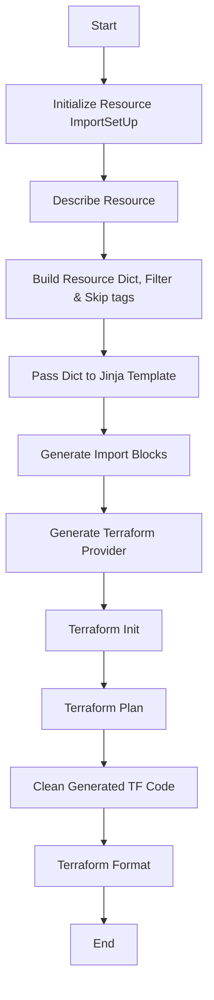

## AZURE TF IMPORT

This Project contains codebase to import AZURE resources in terraform code using  config-driven approach by generating terraform import blocks for resources.

It's using Azure SDK & Jinja Templates to achieve it's state.

## current Supported resources
 * VMS

    * VM Instance
    * Data Disk
    * Data Disk Attachments
    * Extensions
    * Network Interfaces

* DB

    * SQL Instance
    * MYSQL Instance
    * Postgresql Instance
    * Databases

* AKS

    * AKS Cluster
    * Node Pools

* ALB

    * Load Balancer
    * Application Gateway
    * IP Configuration
    * Rules
    * Backend Pools
    * Listeners


### Local Setup

#### Prerequisite

* Terraform
* Python3
* Azure CLI

Steps to Follow :-

1. We will use a separate Virtual environment for python to run this project. Before Proceeding make sure you have python3  and latest terraform installed

2. Install Virtulaenv
```
$ pip3 install virtualenv
```
3. Activate Virtualenv
```
$ virtualenv <dir name>
$ source <dir name>/bin/activate
# for windows
$ ./<dir name>/Scripts/activate.bat
```

4. Install Necessary Packages
```
$ pip3 install -r requirements.txt
```
5. Run the code from root directory

```
$ python main.py
usage: main.py [-h] --subscription-id SUBSCRIPTION_ID --local-repo-path LOCAL_REPO_PATH --resource RESOURCE [--tag key value]
main.py: error: the following arguments are required: --subscription-id, --local-repo-path, --resource
```
if everything is setup properly you will see output similar to above


## Project Structure
```
├── import_alb.py // Class for ALB Import
|
├── import_vms.py // Class for VMS Import
|
├── import_aks.py // Class for AKS Import
|
├── import_rds.py // Class for Azure DB Import
|
├── main.py  // Main python Script for Running code
|
├── pyproject.toml // Settings file for Black Code Formatter
|
├── requirements.txt // Dependecies list
|
├── templates  // Jinja Templates for each resources
│   ├── alb_import.tf.j2
│   ├── backend.tf.j2
│   ├── vm_import.tf.j2
│   ├── aks_import.tf.j2
│   ├── providers.tf.j2
│   └── azuredb_import.tf.j2
|
└── utils          // Helper Function for Cleanup, Running terraform Commands, Create Boto3 Client, Session.
    ├── __init__.py
    ├── cleanup.py
    └── utilities.py
    └── settings.py
|
```


# Resource ImportSetUp Workflow

This document describes the workflow of the `ResourceImportSetUp` class.



## Importing Resources

### Follow these steps:-

1. Login to tenant using azure cli `az login --tenant <TENANT ID>`

2. Create Folder where you want to store the generated files.
    * This can be an existing repo
    * This can be an Empty Directory
    * Make sure to updated aws provider version to latest if it's an existing repo.
    * For Empty directory the script will create one with latest provider configured.

3. Make Use of resource tags to import specific resources and avoid bulk import. examples given below

4. Once resources are generated inspect the final plan to check for any changes.
    * Add `ignore lifecycle rule` to ignore any changes.
    * Might required some other cleanup as well, depends on the situation.

5. Once you are done with `terraform apply`. Add a tag `TF_IMPORTED: true` to these imported resources to avoid duplicate imports.


## Examples

* Import VM instances from subscriptin id with a tag to limit the import radius. Multiple tags supported.
```
python main.py --resource vms --subscription-id <--subscription-id of the azure> --local-repo-path <dir to put the generated files> -t <TAG NAME> <TAG VALUE>
```

* Import ALL VM instances from an azure subscription id
```
python main.py --resource vms --subscription-id <--subscription-id of the azure> --local-repo-path <dir to put the generated files>
```

* Import Azure DB instances from a particular azure subscription id. Supported resource args are `sql, mysql, postgresql`
```
python main.py --resource mysql  --subscription-id <--subscription-id of the azure> --local-repo-path <dir to put the generated files>

```

* Import All AKS Cluster from a particular azure subscription id
```
python main.py --resource aks --subscription-id <--subscription-id of the azure> --local-repo-path <dir to put the generated files>

```

* Import All ALB  from a particular azure subscription id. Supported resource args are `lb, lbgw`
```
python main.py --resource lb  --subscription-id <--subscription-id of the azure> --local-repo-path <dir to put the generated files>

```


## Resource Cleanup
* Null value, empty tags, empty list, 0 values are being cleaned up from all of the resources.
* `jsonencode` func removes decimal which is being corrected for some resources.
* `client_id`, `admin_password` is being set to `Ericsson@123` to prevent breaking.
* More details can be seen in the dict `RESOURCE_CLEANUP` defined in `utils/cleanup.py` file.


## Skip Resources
* Skip DNS records for VMS, it's being managed by other teams.
* Skip Paramater configurations of AZURE DB(SQL, MYSQL, POSTGRESQL), It's being managed by other teams.

## Skip Subscription ID
Below are some resources that are being skipped for some subscription id, it was provided during the session.
This feature is supported through file in `utils/settings.py` file.
Load Balancer in these accounts are being skipped as they all  are managed by Azure Kubernetes and shouldn't be imported with Terraform.

| AKS                                    | VMS                                  | LB                                     |
|----------------------------------------|--------------------------------------|----------------------------------------|
| EitDataAndAnalyticsPlatformProd        | BusLighthouse1Test                   | EitDataAndAnalyticsPlatformProd        |
| AzureAutomationAIMarketPlacebuddybotProd01 | EitDataAndAnalyticsPlatformProd       | AzureAutomationAIMarketPlacebuddybotProd01 |
| EITEricssonDotComAcc                   | EITVirtualWorkspaceERSEU             | BusSpainAteneaProd                     |
| EitA2CockpitTestEU                     | EITVirtualWorkspaceProdAM            | EITEricssonDotComAcc                   |
| BusLighthouse1Test                     | EITVirtualWorkspaceProdAS            | BusLighthouse1Test                     |
|                                        | EITVirtualWorkspaceProdEU            | EitA2CockpitTestEU                     |


## Current Issue
* `admin_password` for windows machine in resource `azurerm_windows_virtual_machine` is a required and sensitive field. It is set to string `Ericsson@123` during cleanup so that `terraform plan` continues without breaking. Please replace it with correct value. Since it's a sensitive value it shouldn't be hardcoded in terraform code.

* `client_secret` for azure kubernetes service in resource `azurerm_kubernetes_cluster` is a required and sensitive param. It is set to string `Ericsson@123` during Cleanup so that `terraform plan`  can continues without breaking. Please replace it with correct value. Since it's a sensitive value it shouldn't be hardcoded in terraform code.

* `data` param for `authentication_certificate` section for resource `authentication_certificate` is a required and sensitive param. if you don't want to manage these from terraform code due to sensitive nature, you can remove `authentication_certificate` section and add it ignore in `lifecycle` block.
```
  lifecycle {
    ignore_changes = [authentication_certificate, ssl_certificate]
  }
```

